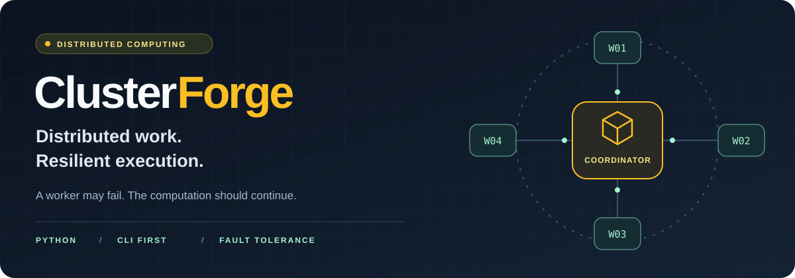
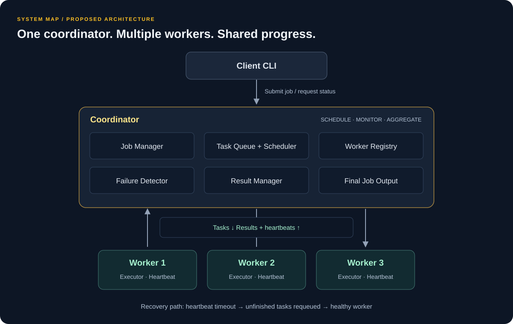
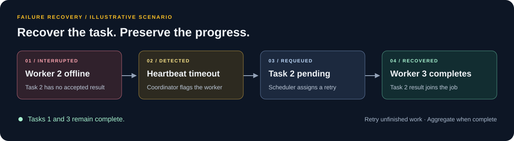

<div align="center">



# ClusterForge

**A fault-tolerant distributed computing system, built for the terminal.**

Split a job. Execute across workers. Recover unfinished tasks when a worker goes offline.


[Overview](#overview) · [Architecture](#architecture) · [CLI walkthrough](#cli-walkthrough) · [Failure recovery](#failure-recovery) · [Development](#development)

</div>

---

## Overview

**A worker may fail. The computation should continue.**

ClusterForge is a Python distributed computing project designed to coordinate computational work across multiple machines. A central Coordinator splits jobs into independent tasks, schedules them on available Workers, and combines their results.

Its core focus is **worker-failure recovery**: detect an unresponsive worker through heartbeat monitoring, return its unfinished tasks to the queue, and assign them to a healthy worker. Completed work should be preserved instead of restarting the entire job.

> **Project stage — system design.** This README describes the intended system. Commands, output, and directory layouts are illustrative; a runnable implementation and verified installation procedure are not included in this documentation package.

## Designed capabilities

| Capability | What it enables |
| :--- | :--- |
| **Distributed execution** | Process one job across multiple worker nodes. |
| **Parallel processing** | Run independent tasks concurrently. |
| **Task scheduling** | Match queued work to available workers. |
| **Worker registration** | Track workers that join the cluster. |
| **Heartbeat monitoring** | Maintain a view of worker availability. |
| **Failure recovery** | Reassign unfinished work after a worker timeout. |
| **Result aggregation** | Collect task outputs and assemble the final result. |
| **Terminal workflow** | Submit jobs and inspect cluster status through a CLI. |

## Architecture



### Responsibilities

| Component | Responsibility |
| :--- | :--- |
| **Client CLI** | Submit computational jobs and request cluster status. |
| **Job Manager** | Divide jobs into tasks and track overall progress. |
| **Task Scheduler & Queue** | Hold pending tasks and dispatch them to available workers. |
| **Worker Registry** | Track registered workers and their availability. |
| **Failure Detector** | Watch heartbeat deadlines and identify unresponsive workers. |
| **Worker Executor** | Execute assigned tasks and return results. |
| **Result Manager** | Collect task results and produce the final job output. |

### From submission to result

1. **Submit** — the Client sends a job to the Coordinator.
2. **Partition** — the Job Manager creates smaller, independent tasks.
3. **Schedule** — the Scheduler assigns queued tasks to available workers.
4. **Execute** — workers process tasks in parallel and send heartbeats.
5. **Collect** — the Coordinator records completed task results.
6. **Aggregate** — the Result Manager combines outputs once the required tasks complete.

If a worker becomes unavailable during execution, its unfinished work returns to the scheduling flow. See [Failure recovery](#failure-recovery).

## CLI walkthrough

The proposed CLI keeps the cluster workflow small: start a Coordinator, start workers, submit a job, and inspect progress.

**Illustrative commands, aligned with the planned module layout.** Run long-lived processes in separate terminals from the project root once these entry points are implemented.

```bash
# Terminal 1 · Start the coordinator
python -m coordinator.coordinator

# Terminals 2–4 · Start one worker per terminal
python -m worker.worker --id worker1
python -m worker.worker --id worker2
python -m worker.worker --id worker3

# Client terminal · Submit work and inspect the cluster
python -m client.client submit --input data.txt
python -m client.client status
```

Coordinator addresses, ports, input formats, and environment setup will be documented with the implementation.

<details open>
<summary><strong>Example cluster status</strong></summary>

Illustrative output; these counts do not represent a live cluster.

```text
CLUSTERFORGE / CLUSTER STATUS
─────────────────────────────────────
Coordinator    RUNNING

WORKER         STATE
worker1        ONLINE
worker2        ONLINE
worker3        ONLINE

TASKS          COUNT
Pending            2
Running            3
Completed         15
Failed             0
─────────────────────────────────────
```

</details>

## Failure recovery

Consider a job with three tasks. Each worker receives one task, but `worker2` goes offline before returning its result.



| Step | Coordinator action | Intended outcome |
| :--- | :--- | :--- |
| **Detect** | Observe that `worker2` has missed its heartbeat deadline. | Mark the worker unavailable. |
| **Identify** | Find tasks assigned to it without accepted results. | Recover only unfinished work. |
| **Requeue** | Return those tasks to the pending queue. | Make them eligible for scheduling again. |
| **Reassign** | Dispatch `task2` when a healthy worker is available. | Resume progress on the job. |
| **Complete** | Accept the recovered task result and aggregate outputs. | Finish the job without restarting completed tasks. |

<details>
<summary><strong>Example recovery log</strong></summary>

```text
[coordinator] worker2 heartbeat timeout
[coordinator] worker2 marked unavailable
[coordinator] task2 returned to pending queue
[scheduler]   task2 assigned to worker3
[worker3]     task2 completed
[coordinator] all task results collected; aggregating job output
```

This is an illustrative sequence, not captured runtime output.

</details>

### Recovery boundaries

Heartbeat timeouts indicate suspected unavailability: a slow worker or network interruption can look like a failure. A timed-out worker may still finish its original task after reassignment.

The implementation therefore needs explicit decisions about **task identity, duplicate and late results, retry limits, and safe task re-execution**. Exactly-once execution is not established by this design. Workloads should use independent tasks that can be retried safely.

The fault-tolerance scope here is **worker failure**. Coordinator failover and durable recovery after a Coordinator restart are not specified. If no healthy worker is available, recovered tasks must wait for capacity.

## Technology direction

| Area | Proposed technology | Design note |
| :--- | :--- | :--- |
| Core implementation | **Python** | Coordinator, workers, and client. |
| Node communication | **gRPC or HTTP** | Transport remains to be selected. |
| Serialization | **Protocol Buffers or JSON** | Choose alongside the transport. |
| Concurrency | **Multiprocessing / asyncio** | Select execution and I/O models for the workload. |
| Local cluster environment | **Docker** | Planned multi-node development setup. |
| Primary platform | **Linux** | Target development environment. |
| Testing | **pytest** | Planned unit and integration testing. |
| Collaboration | **Git & GitHub** | Source control and project discussion. |

## Development

### Proposed repository layout

```text
ClusterForge/
├── coordinator/
│   ├── coordinator.py        # Job orchestration and service entry point
│   ├── scheduler.py          # Worker selection and task assignment
│   ├── task_queue.py         # Pending-task management
│   ├── worker_manager.py     # Registration and worker availability
│   ├── failure_detector.py   # Heartbeat deadlines and recovery triggers
│   └── result_manager.py     # Result collection and aggregation
├── worker/
│   ├── worker.py             # Worker entry point
│   ├── executor.py           # Task execution
│   └── heartbeat.py          # Periodic liveness reporting
├── client/
│   └── client.py             # Submit and status commands
├── common/
│   ├── models.py             # Shared job, task, and worker models
│   └── protocol/             # Message contracts
├── tests/                    # Unit and integration tests
├── docker/                   # Multi-node development configuration
├── ./                   # README visuals
├── requirements.txt          # Python dependencies
└── README.md
```

This is the target layout; the current package contains the README and its SVG ..

### Implementation milestones

- [ ] **Define the contract** — select the transport, message schemas, task states, and supported input format.
- [ ] **Complete one task end to end** — submit, schedule, execute, and collect a result with one worker.
- [ ] **Distribute a job** — register multiple workers, execute in parallel, and aggregate task results.
- [ ] **Recover interrupted work** — add heartbeats, timeout detection, reassignment, and result deduplication.
- [ ] **Make the system observable** — expose useful cluster status and task lifecycle logs.
- [ ] **Make the demo reproducible** — document setup, add Docker configuration, and validate failure scenarios.

### Validation targets

| Scenario | Expected behavior to verify |
| :--- | :--- |
| Multiple healthy workers | Distributed output matches a known reference result. |
| Worker stops during a task | Unfinished work is reassigned; completed work is retained. |
| Delayed result after timeout | A duplicate or stale result cannot corrupt aggregation. |
| No available workers | Pending work remains queued until capacity becomes available. |
| A task repeatedly fails | A bounded retry policy produces an inspectable terminal state. |

### Contributing

Useful early contributions include protocol design, scheduling policies, reproducible failure scenarios, and focused tests. Open an issue with the problem, proposed behavior, and validation approach before making a substantial architectural change.

For bug reports, include the workload, worker count, reproduction steps, and relevant Coordinator and Worker logs. Contribution commands and checks will be added once the implementation is available.

## Scope

ClusterForge is a distributed computing learning and engineering project focused on scheduling, communication, worker monitoring, recovery, and aggregation. The CLI keeps development centered on these mechanisms.

A web dashboard, enterprise cloud orchestration, complex authentication, and production-scale operations are outside the initial scope.

**License:** to be selected. Add a `LICENSE` file before publishing licensing or reuse claims.

---

<div align="center">

**Distribute the work. Detect failures. Recover the work. Complete the job.**

[Back to top](#clusterforge)

</div>
